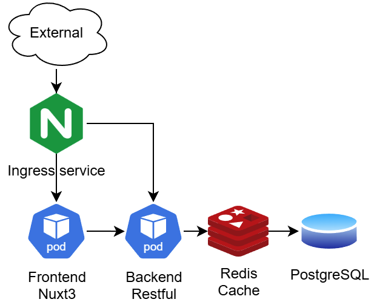

# Aimmlab Website 


National Chin-Yi University of Technology E423 Image Website based on Nuxt3.


## 目錄
- [介紹](#介紹)
- [快速部屬](#快速部屬)
- [架構圖](#架構圖)


## 介紹
本專案主要為實驗室的網站，整體設計為 microservice (微服務)，搭到部屬方便以及依靠 Git Action 實現自動部屬及測試，前端採用 Nuxt3 開發、後端採用 GQL，並透過 ingress`限制單位時間 Request 數量`、 `Redis 快取`、`多POD部屬`...等解決`高併發問題`。


## 快速部屬
依靠 infra 快速部屬，或是採用 Docker Build Image 部屬
<br>
Check this infra repo -> [Aimmalab Infra](https://github.com/YuQuang/Aimmalab-Infra)
<br>
``` bash
Docker build -t aimmalab-website .
```


## 架構圖

1. Frontend Nuxt3 前端伺服器
2. Backend Apollo GraphQL 伺服器
3. Redis 快取暫時存放如使用者，短時間可能會重複取得的快取資料
4. PostgreSQL 後端主要資料庫